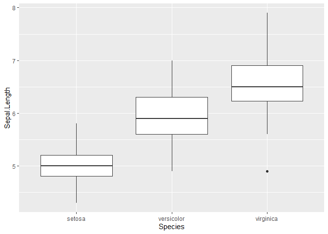
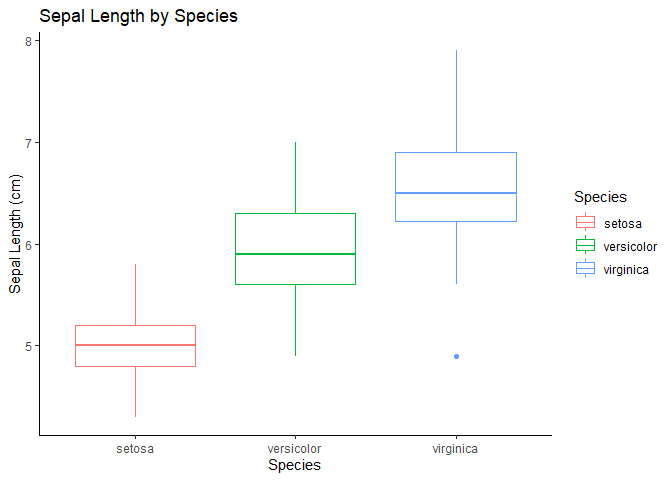
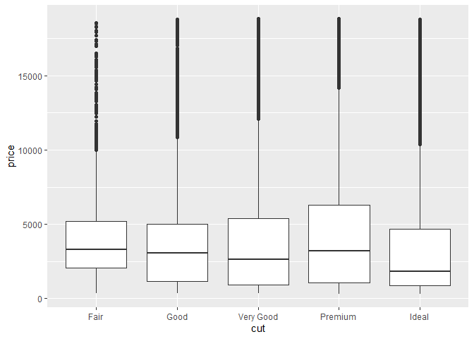
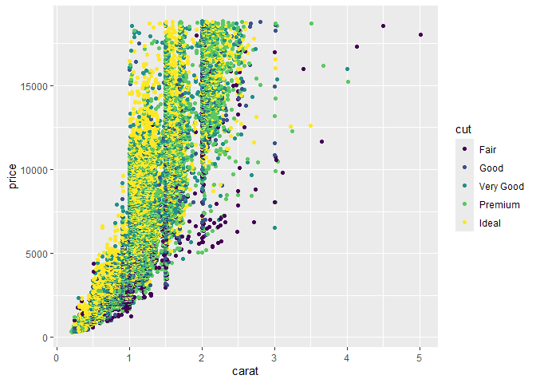

Introduction to R
================
Madison Sandqust
2026-01-09

## R Markdown

This is an R Markdown document. Markdown is a simple formatting syntax
for authoring HTML, PDF, and MS Word documents. For more details on
using R Markdown see <http://rmarkdown.rstudio.com>.

## Looking at the dataframe

Today, we will be using data that is already in R to go over some basic
functions.

``` r
data("iris") # this is a data frame already loaded into R

head(iris) # use head function to see the content of data set 
```

    ##   Sepal.Length Sepal.Width Petal.Length Petal.Width Species
    ## 1          5.1         3.5          1.4         0.2  setosa
    ## 2          4.9         3.0          1.4         0.2  setosa
    ## 3          4.7         3.2          1.3         0.2  setosa
    ## 4          4.6         3.1          1.5         0.2  setosa
    ## 5          5.0         3.6          1.4         0.2  setosa
    ## 6          5.4         3.9          1.7         0.4  setosa

``` r
nrow(iris) # the number of rows in the data set 
```

    ## [1] 150

``` r
ncol(iris) # the number of columns
```

    ## [1] 5

## Pacakges - Introduction in Tidyverse

R has a lot of power in its basic form, but one of the most important
parts about R is that it is expandable by the work of other people.
These expansions are usually released in “packages”. One of the most
widely used packaged is tidyverse, which is used to manipulate and clean
data. Throughout this course we will be using the basic functions in
tidyverse

``` r
# in order to use a package, you need to first load it in. To do so use the library() function. 
library(tidyverse)
```

    ## ── Attaching core tidyverse packages ──────────────────────── tidyverse 2.0.0 ──
    ## ✔ dplyr     1.1.4     ✔ readr     2.1.5
    ## ✔ forcats   1.0.0     ✔ stringr   1.5.1
    ## ✔ ggplot2   3.5.2     ✔ tibble    3.2.1
    ## ✔ lubridate 1.9.4     ✔ tidyr     1.3.1
    ## ✔ purrr     1.0.4     
    ## ── Conflicts ────────────────────────────────────────── tidyverse_conflicts() ──
    ## ✖ dplyr::filter() masks stats::filter()
    ## ✖ dplyr::lag()    masks stats::lag()
    ## ℹ Use the conflicted package (<http://conflicted.r-lib.org/>) to force all conflicts to become errors

### Creating a new column

To create a new column, use the mutate function within the package

``` r
df <- iris #this line of code just makes the iris data set a object 

df2 <- df %>%
  mutate(sepal.minus.petal.length = Sepal.Length - Petal.Length)
#this line of code reads: df2 is same data frame as df but with a new column that subtracts sepal length from petal length 

head(df2)
```

    ##   Sepal.Length Sepal.Width Petal.Length Petal.Width Species
    ## 1          5.1         3.5          1.4         0.2  setosa
    ## 2          4.9         3.0          1.4         0.2  setosa
    ## 3          4.7         3.2          1.3         0.2  setosa
    ## 4          4.6         3.1          1.5         0.2  setosa
    ## 5          5.0         3.6          1.4         0.2  setosa
    ## 6          5.4         3.9          1.7         0.4  setosa
    ##   sepal.minus.petal.length
    ## 1                      3.7
    ## 2                      3.5
    ## 3                      3.4
    ## 4                      3.1
    ## 5                      3.6
    ## 6                      3.7

### Summary

To summarize you data, use the summarize function that collapses all
rows and returns a one-row summary

``` r
df3 <- df %>% 
  summarize(Average.Sepal.Length = mean(Sepal.Length))


# this line reads, i want to make df3 from df but collapses the rows into a one row summary of the mean 
# basically taking the mean of each row
head(df3)
```

    ##   Average.Sepal.Length
    ## 1             5.843333

``` r
# But the problem is there are different groups, so this summary is not the most informative as possible, so lets get the averages of all groups
colnames(df)
```

    ## [1] "Sepal.Length" "Sepal.Width"  "Petal.Length" "Petal.Width"  "Species"

``` r
# Lets see what the groups of species are
unique(df$Species)
```

    ## [1] setosa     versicolor virginica 
    ## Levels: setosa versicolor virginica

### Grouping

Use the group by function to group certain groups together before
calculations

``` r
df3 <- df %>% 
  group_by(Species) %>% 
  summarize(Average.Sepal.Length = mean(Sepal.Length))

head(df3)
```

    ## # A tibble: 3 × 2
    ##   Species    Average.Sepal.Length
    ##   <fct>                     <dbl>
    ## 1 setosa                     5.01
    ## 2 versicolor                 5.94
    ## 3 virginica                  6.59

``` r
# this is much different compared to the mean not grouping by species.
```

So what if we don’t want to use the whole data set and just a subset of
the data, we can filter so specific information.

### Filtering

Filtering only retains specific rows of data that meet the specified
requirement(s).

``` r
df4 <- df %>% 
  filter(Sepal.Length > 5) #filter by numerical value

df5 <- df %>% 
  filter(Species == "setosa") # filter by category

df6 <- df %>% 
  filter(Species == "setosa", Sepal.Length > 5) # filtering by both at the same time

head(df6)
```

    ##   Sepal.Length Sepal.Width Petal.Length Petal.Width Species
    ## 1          5.1         3.5          1.4         0.2  setosa
    ## 2          5.4         3.9          1.7         0.4  setosa
    ## 3          5.4         3.7          1.5         0.2  setosa
    ## 4          5.8         4.0          1.2         0.2  setosa
    ## 5          5.7         4.4          1.5         0.4  setosa
    ## 6          5.4         3.9          1.3         0.4  setosa

### Selecting

So right now our data frame has 5 columns. If we want to simplify our df
and only care about sepals, we can select for those columns

``` r
head(df)
```

    ##   Sepal.Length Sepal.Width Petal.Length Petal.Width Species
    ## 1          5.1         3.5          1.4         0.2  setosa
    ## 2          4.9         3.0          1.4         0.2  setosa
    ## 3          4.7         3.2          1.3         0.2  setosa
    ## 4          4.6         3.1          1.5         0.2  setosa
    ## 5          5.0         3.6          1.4         0.2  setosa
    ## 6          5.4         3.9          1.7         0.4  setosa

``` r
df7 <- df %>%
  select(Sepal.Length, Sepal.Width, Species)

head(df7) #now we only have a dataframe with information about sepals and also species
```

    ##   Sepal.Length Sepal.Width Species
    ## 1          5.1         3.5  setosa
    ## 2          4.9         3.0  setosa
    ## 3          4.7         3.2  setosa
    ## 4          4.6         3.1  setosa
    ## 5          5.0         3.6  setosa
    ## 6          5.4         3.9  setosa

## Intro to ggplot

Another really useful package is ggplot - which is apart of the
tidyverse package. Ggplot is useful in plotting data

``` r
flower <- ggplot(iris, aes(x = Species, y = Sepal.Length))+
  geom_boxplot()

flower
```

<!-- -->

Lets make it a little fancier… For lab reports, your graphs should have
title, x and y axis label, and a touch of color.

``` r
flower <- ggplot(iris, aes(x = Species, y = Sepal.Length, color = Species))+
  geom_boxplot() + 
labs(
    title = "Sepal Length by Species",
    x = "Species",
    y = "Sepal Length (cm)"
  )+
theme_classic()

flower
```

<!-- -->

# Diamond Example

Questions -

How many rows and columns are in the data set diamonds?

What is the average price for each cut of diamond?

What is the average price for each caret of diamond?

Which do you think is more influential in pricing of diamonds?

``` r
diamonds <- diamonds

nrow(diamonds) # number of rows
```

    ## [1] 53940

``` r
ncol(diamonds) # number of columns 
```

    ## [1] 10

``` r
head(diamonds)
```

    ## # A tibble: 6 × 10
    ##   carat cut       color clarity depth table price     x     y     z
    ##   <dbl> <ord>     <ord> <ord>   <dbl> <dbl> <int> <dbl> <dbl> <dbl>
    ## 1  0.23 Ideal     E     SI2      61.5    55   326  3.95  3.98  2.43
    ## 2  0.21 Premium   E     SI1      59.8    61   326  3.89  3.84  2.31
    ## 3  0.23 Good      E     VS1      56.9    65   327  4.05  4.07  2.31
    ## 4  0.29 Premium   I     VS2      62.4    58   334  4.2   4.23  2.63
    ## 5  0.31 Good      J     SI2      63.3    58   335  4.34  4.35  2.75
    ## 6  0.24 Very Good J     VVS2     62.8    57   336  3.94  3.96  2.48

``` r
# average price by cut
df2 <- diamonds %>% 
  select(cut, price) %>% 
  group_by(cut) %>% 
  summarize(average_price = mean(price))

df2
```

    ## # A tibble: 5 × 2
    ##   cut       average_price
    ##   <ord>             <dbl>
    ## 1 Fair              4359.
    ## 2 Good              3929.
    ## 3 Very Good         3982.
    ## 4 Premium           4584.
    ## 5 Ideal             3458.

``` r
# average price by caret
df3 <- diamonds %>% 
  select(carat, price) %>% 
  group_by(carat) %>% 
  summarize(average_price = mean(price))

df3
```

    ## # A tibble: 273 × 2
    ##    carat average_price
    ##    <dbl>         <dbl>
    ##  1  0.2           365.
    ##  2  0.21          380.
    ##  3  0.22          391.
    ##  4  0.23          486.
    ##  5  0.24          505.
    ##  6  0.25          551.
    ##  7  0.26          551.
    ##  8  0.27          575.
    ##  9  0.28          580.
    ## 10  0.29          601.
    ## # ℹ 263 more rows

### Plotting

``` r
# boxplot price by cut
p <- ggplot(diamonds, aes(x=cut, y=price)) + 
  geom_boxplot()
p
```

<!-- -->

``` r
# scatter plot by caret color by cut. 
p2 <- ggplot(diamonds, aes(x=carat, y =price, color = cut))+
  geom_point()

p2
```

<!-- -->
